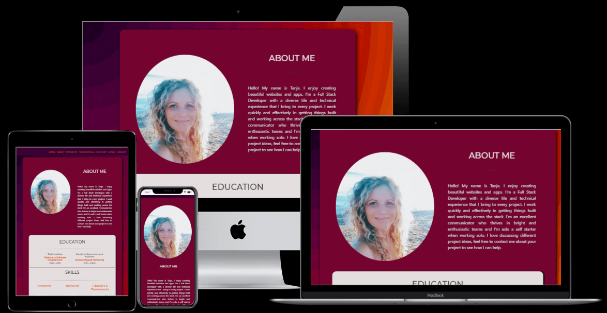
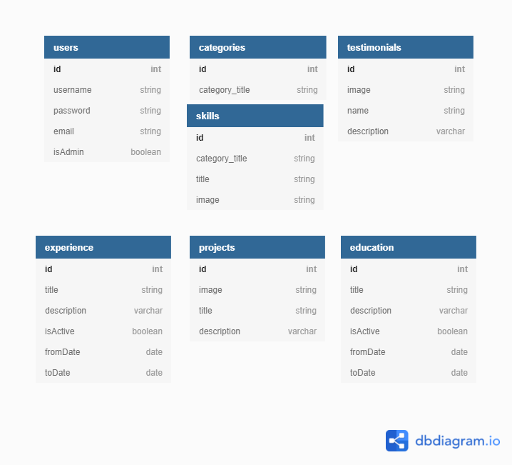
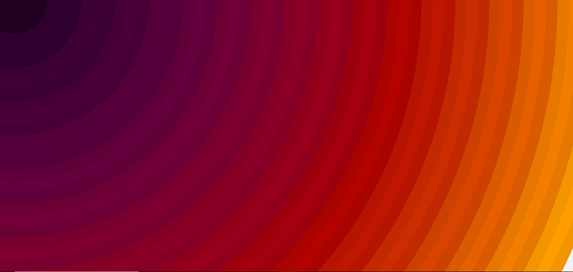

# **My Portfolio**

## **About the project**
This project is a personal portfolio website that will showcase my software development skills and my recent projects, to potential employers, potential clients or other developers. It will also serve as one of the milestone projects for the Code Institute Software Development Diploma course, where I needed to showcase what I've learned from the Python/Flask/MongoDB backend modules. 

The original idea was to have a log in option so that users can add to the website or change something depending on their credentials. Myself as an **admin** would have the rights to make changes to all sections that have that option, while the **guest** user will be able to add or edit only testimonials after they have collaborated with me. I then changed the concept so that user cannot make any changes, until I implement some sort of notification system for when a testimonial is added, so that I can review it before it is posted to the live site. For now only admin has the rights to make changes to the website. 

## Table of contents 
* [UX](#ux)
* [The Strategy Plane](#the-strategy-plane)
    * [User Goals](#user-goals)
    * [Site Owners Goals](#site-owners-goals)
    * [User Stories](#user-stories)
       * [Recruiters and Employers](#recruiters-and-employers)
        * [Other Developers](#other-developers)
        * [Potential Clients](#potential-clients)
* [The Scope Plane](#the-scope-plane)
    * [Existing Features](#existing-features)
    * [Features to be implemented](#features-to-be-implemented)
* [The Structure Plane](#the-structure-plane)
* [The Skeleton Plane](#the-skeleton-plane)
    * [Wireframes](#wireframes)
    * [Flowcharts](#flowcharts)
    * [Database Structure](#database-structure)
* [The Surface Plane](#the-surface-plane)
    * [Design Choices](#design-choices)
        * [Fonts](#fonts)
        * [Colors](#colors)
* [Technologies used](#technologies-used)
    * [Languages](#languages)
    * [Libraries and Frameworks](#libraries-and-frameworks)
    * [Tools](#tools)
* [Testing](#testing)
* [Deployment](#deployment)
    * [Heroku Deployment](#heroku-deployment)
    * [Run Locally](#run-locally)
    
* [Credits](#credits)

--- 

# **UX**

## **The Strategy Plane**

### **User Goals**

Users can be divided into three categories:

* ### **Recruiters and potential employers**
  The user, in this case, is a person who is looking to hire a developer and on this website, they need to be able to find all the information necessary for them to decide to invite me for an interview or offer me a job. 
  * Users goal is to be able to find skills and experience to see if it suits the role they have in mind.
  * Users goal is to be able to see projects that I've worked on to see what type of work I've done and what are my competencies
  * Users goal is to see my previous employment to get a feel if someone my experience would be a good fit for their team
  * Users goal is to be able to find the contact information easily and contact me without leaving the page 
  * User goal is to be able to download my CV with one click 

* ### **Other developers** 
    The user, in this case, is another developer who is looking for someone to work on a project with or a collaboration of some sort.

    * This user's goal is to be able to see what skills I have and what tech stack I use, to see if we could work well together
    * Users goal is to be able to find my GitHub profile to see the way I write my code and if this would suit their project
    * Users goal is to find contact information easily and contact me from the website directly

* ### **Potential Clients**
    The user in this case can be a person, a company, an artist, a small business, anyone who is lookig to hire someone to create their website, an app or change their existing website, etc. 

    * This user's goal is to be able to see the projects that I have  created before, to see if they would like to hire me for their project
    * This user's goal is to be able to see the testimonials from others that have worked with me, to evaluate if they want to hire me
    * This user's goal is to be able to find the contact information easily and contact the site owner without leaving the page 

[Back to Top](#table-of-contents)

### **Site owners Goals**

My the goal is to have a beautiful and reponsive website that represents me as a person and also as a developer. I'd like potential employers to find it interesting enough to want to explore it and find out about me, my accomplishments, my skills, and that they will want to get in touch for an interview, a project or a collaboration, as a result.   

  As an **admin** user I want to be be able to log in and make changes to the website, for example, add a new skill, add a new project, new job, new testimonial etc., directly from the admin dashboard, without needing to change the code. 

### **User Stories**
  
#### **Recruiters and Employers** 

* As a busy user, I am using a lot of devices and I would like to be able to see this page equally well on any device I am currently using

* As a user, I would like the site to be intuitive and have easy navigation so that I can quickly and easily access the information I am looking for

* As a user, I would like to see the information about the site owner, to see how they present themselves and how they look like

* As a user, I would like to be able to see the site owners past experiences and their projects to see if the skills they have match the role I am looking to fill

* As a user, I would like to see site owners the LinkedIn page

* As a user, I would like to be able to contact the site owner easily and without leaving the page

* As a user, I would like to be able to find and download the site owners CV directly from the website

 
#### **Other Developers** 

* As a user, I would like to see the projects site owner was working on and the skills they have, to see if we could potentially work together on a project

* As a user, I would like to be able to see the site owners GitHub link to see how they are putting their skills to use, and how their skills developed over time

#### **Potential Clients**

* As a user I would like to be able to see the projects that the site owner has made, to see if I would like to hire them for my project

* As a user, I would like to see the testimonials from people that have worked with the site owner, to confirm my decision for choosing them for my project

* As a user, I would like to be able to find the contact details easily, and contact the site owner without leaving the page 

[Back to Top](#table-of-contents)

## **The Scope Plane**

## **Features**

### **Existing Features**

* Responsive design
* Registration functionality
* Log In and Out functionality
* Dashboard where user can access the functionalities they have with their credentials
* As an admin: 
    * CRUD Operations
   * Skills
        * Create: create a new skill
        * Read: after creating a skill, user can click View Skills button and is then directed to the index page -  the skill section - where they can view the skill they've just added, plus all other skills
        * Update: possibility to edit the skill
        * Delete: possibility to delete the skill
    * Testimonials
        * Create: create a new testimonial
        * Read: after creating a testimonial, user can click View Testimonials button and will be directed to the index page, the testimonial section, where they can see the testimonial they've just added plus all other testimonials
        * Update: possibility to edit the testimonial
        * Delete: possibility to delete the testimonial
* Guest user can currently register/login however they do not have access to editing the website
* Visitors can click on the email address in the footer and will be directed to the email provider so they can send an email directly from the website

### **Features to be implemented**

In the future I would like to add functionality to the dashboard so that admin can Add, Edit  and Delete Projects, Employment details and Education details, the same way it is possibe to add skills and testimonials now.

I would also like to expand the dashboard to include some statistics about the page and links to the relevant sections available for edit. As mentioned above I would also love to add an option to receive a notification when user leaves a review so that I cann approve it. 

In the future I will also add a separate page for each project to provide more details on what is included in each project, the proces of making it, a few more images and demo gifs. 

I would also like to add a contact form so people can have that option as well to contact me without leaving the page.

[Back to Top](#table-of-contents)

## **The Structure Plane**

The website structure is built according to the standard UI/UX rules so that it is intuituve and makes it easy for the user to find what they are looking for.
* All the main information is placed on the one scrolling page with links to each section in the navigation bar 
* The navigation bar is on top of the page and the menu links will change color on hover so the user can jump to a different section on the website should they wish
* Navbar will disappear when the user scrolls down but will reappaear when user scrolls up so they can go to another section quicker. 
* Footer contains contact information, social media icons and a link to download my CV for anyone who would like a copy

The admin side of the website has additional pages
* Register, Log in/Logout - currently hidden from the dashboard so visitors cannot register
* Admin dashboard -  where admin can see what changes he can make with his credentials 
* Add/Edit skill pages - where admin can add or edit a skill
* Add/Edit testimonial - where admin can add or edit a testimonial

## **The Skeleton Plane**

### **Database Schema**

The database used for this project is the document-based database MongoDB. 
The database consists of four collections :
* **Users** - contains the data required for user to register, login, access admin panel (if the user is **is_admin**)
* **Categories**  - Skill categories are divided into three categories - Frontend, Backend and Libraries & Frameworks. This data is used when adding a new skill or editing a skill
* **Testimonials** - Stores data for adding a new testimonial and pulls data from here when editing testimonials
* **Skills** - data that is stored here is skill category, skill name (title) and skill image path.

The three other collections **Experience**, **Projects** and **Education** are not currently in use. Plan is to implement them shortly to be able to add relevant work experience, education details and any new projects. 

### **Wireframes**

#### Index Page Wireframes
[Hello Section](static/images/wireframes/hello.png)\
[About Me Section](static/images/wireframes/about-me.png)\
[My Projects Section](static/images/wireframes/my-projects.png)\
[Testimonials Section](static/images/wireframes/testimonials.png)

#### Admin Login Pages Wireframes
[Register / Log In](static/images/wireframes/register-login.png)\
[Dashboard](static/images/wireframes/dashboard.png)

#### CRUD Operations Pages Wireframes
[Add / Edit Skill](static/images/wireframes/add-edit-skill.png)\
[Add / Edit Testimonial](static/images/wireframes/add-edit-testimonial.png)

## **The Surface Plane**

### **Design Choices**

#### **Colors**

I chose the background image with an array of rainbow colors and in order to have complementary colors on the rest of the website, I used the [Image Color Picker](https://imagecolorpicker.com/) to choose the colors to use for different elements and sections.

 

I used the color    #3b0432 for the navbar and the footer.\
The  color   rgb(243, 96, 51) for contrasting the purple in titles, icons, buttons etc.\
The  #74042f color was used as a background color for different sections on the index page.

#### **Typography**

Main font for the website is **Montserrat** with the fallback font  sans-serif, if for any reason the google font doesn't load. \
I have also used **-apple-system, BlinkMacSystemFont, 'Segoe UI', Roboto, Oxygen, Ubuntu, Cantarell, 'Open Sans', 'Helvetica Neue', sans-serif;** for some paragraphs as it looks much cleaner. 

[Back to Top](#table-of-contents)

---

# **Technologies used**

### **Languages**

* [HTML](https://en.wikipedia.org/wiki/HTML)
* [CSS](https://en.wikipedia.org/wiki/Cascading_Style_Sheets)
* [JavaScript](https://en.wikipedia.org/wiki/JavaScript)
* [Python](https://www.python.org/)

### **Libraries and Frameworks**

* [Font Awesome](https://fontawesome.com/)
* [Bootstrap](https://getbootstrap.com/)
* [Google Fonts](https://fonts.google.com/)
* [jQuery](https://jquery.com/)

### **Tools**
* [Git](https://git-scm.com/)
* [GitPod](https://www.gitpod.io/)
* [Heroku](https://www.heroku.com/)
* [Balsamiq](https://balsamiq.com/wireframes/)
* [W3C HTML Validation Service](https://validator.w3.org/)
* [W3C CSS Validation Service](https://jigsaw.w3.org/css-validator/)
* [techsini](http://techsini.com/)
* [MongoDB Atlas](https://www.mongodb.com/)
* [Flask](https://flask.palletsprojects.com/en/1.1.x/)
* [PyMongo](https://api.mongodb.com/python/current/tutorial.html)
* [Jinja](https://jinja.palletsprojects.com/en/2.11.x/)

[Back to Top](#table-of-contents)

# **Testing**

The full testing procedure can be found in the [Testing](testing.md) file

[Back to Top](#table-of-contents)

# **Deployment**

## Heroku Deployment

**Create application:**
1. Navigate to Heroku.com and login
1. Click on the new button
1. Select create new app
1. Enter the app name
1. Select region

**Set up connection to Github Repository:**

1. Click the deploy tab and select GitHub - Connect to GitHub.
1. A prompt to find a github repository to connect to will then be displayed.
1. Enter the repository name for the project and click search.
1. Once the repo has been found, click the connect button.

**Set environment variables:**

Click the settings tab and then click the Reveal Config Vars button and add the following:

1. key: IP, value: 0.0.0.0
2. key: PORT, value: 5000
3. key: MONGO_DBNAME, value: (database name you want to connect to)
4. key: MONGO_URI, value: (mongo uri - This can be found in MongoDB by going to clusters > connect > connect to your application and substituting the password and 
    dbname that you set up in the link).
5. key: SECRET_KEY, value: (This is a custom secret key set up for configuration to keep client-side sessions secure).

**Enable automatic deployment:**
1. Click the Deploy tab
1. In the Automatic deploys section, choose the branch you want to deploy from then click Enable Automation Deploys.

## Run Locally

1. Navigate to the GitHub [Repository](https://github.com/TanYa-Go/TanjaG.Portfolio).
1. Click the Code drop down menu.
1. Either Download the ZIP file, unpackage locally and open with IDE (This route ends here) OR Copy Git URL from the HTTPS dialogue box.
1. Open your developement editor of choice and open a terminal window in a directory of your choice.
1. Use the 'git clone' command in terminal followed by the copied git URL.
1. A clone of the project will be created locally on your machine.

Once the project has been loaded into an IDE of choice, run the following command in the shell to install all the required packages:
> pip install -r requirements.txt

Note: The project will not run locally with database connections unless the user sets up an [env.py](https://pypi.org/project/env.py/) file configuring IP, PORT, 
MONGO_URI, MONGO_DBNAME and SECRET_KEY. You must have the connection details in order to do this. These details are private and not disclosed in this repository 
for security purposes.  

[Back to Top](#table-of-contents)

# **Credits**

### **Code**

Code institute Tim Nelson's Task Manager project was a great help while creating this project

I've learned a lot from Corey Schafer and his Pyhton/flask [tutorial](https://www.youtube.com/watch?v=MwZwr5Tvyxo&list=RDCMUCCezIgC97PvUuR4_gbFUs5g&index=11)

Took inspiration from [Ania Kubow](https://www.youtube.com/watch?v=-D6oTPA4vXc&t=4221s) for layout of the page

Borrowed code from [here](https://tobiasahlin.com/moving-letters/#10) to animate letters on the home page 

### **Media**

[Background image](https://www.svgbackgrounds.com/#rainbow-vortex) was found here.\
Image for the (fake) testimonial with the name John Boyle is a Photo by <a href="https://unsplash.com/@christianbuehner?utm_source=unsplash&utm_medium=referral&utm_content=creditCopyText">christian buehner</a> on <a href="https://unsplash.com/s/photos/a-man-with-glasses?utm_source=unsplash&utm_medium=referral&utm_content=creditCopyText">Unsplash</a>
   \
The other two are genuine testimonials and the images were provided by Melinda and Rebecca personally. 

Icons for the skills were taken from the [Image Bin](https://imgbin.com/)

### **Acknowledgements**

I would like to thank my mentor Simen Daehlin for the continuous support, encouragement and knowledge that he so generously shares. 

I'd also like to thank Richard Wells for his advices and suggestions on how to improve the site. 

[Back to Top](#table-of-contents)

