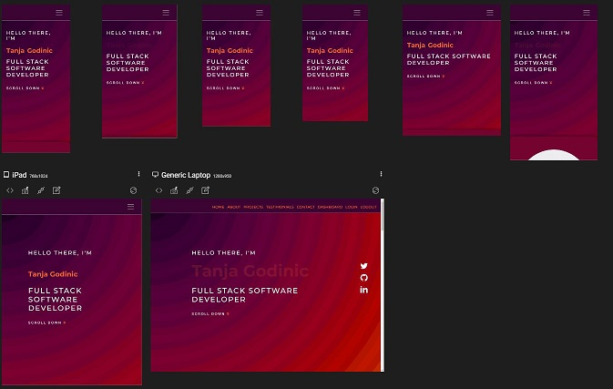
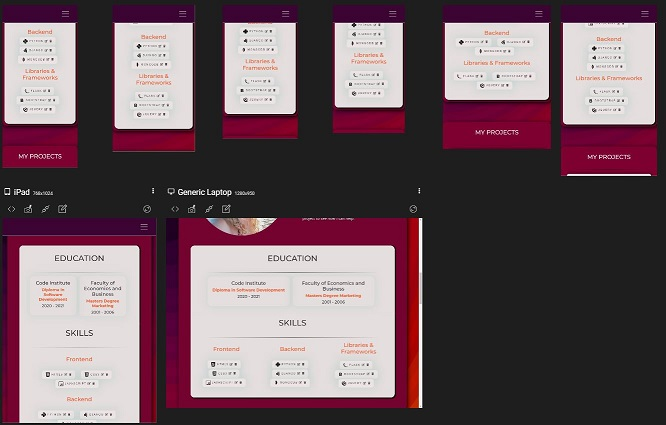
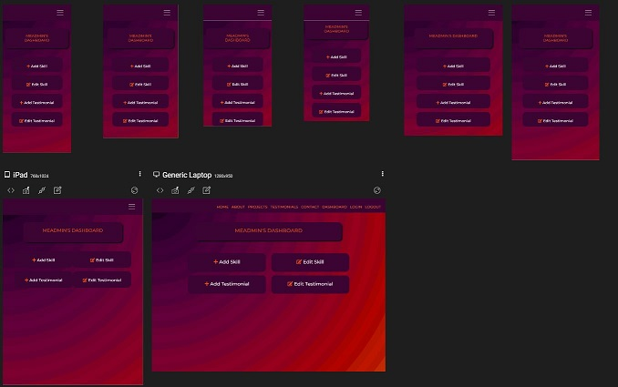
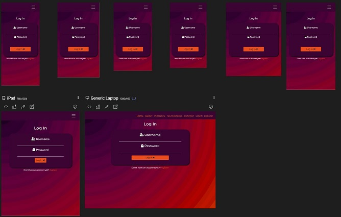

## User Stories Testing

* ### **Recruiters and potential employers**

    * Users goal is to be able to find my skills and experience to see if it suits the role they have in mind.

        Skills and Education sections are displayed on the index page and can be accessed by scrolling down or by clicking on the navigation menu corresponding item.

        I have decided not to include the Work History details on the portfolio as I don't have the relevant experience yet. However, the user can see my previous employment by visiting my LinkedIn page or by accessing my CV from the footer. 

    * Users goal is to be able to see projects that I've worked on to see what type of work I've done and what are my competencies 

        My projects are displayed on the index page in the **My Projects** section and can be accessed by scrolling down or by clicking on the navigation menu corresponding item. To see more about each project, the user can click on the links below each project and access either the **live site** or **the repository** which will open in a separate tab.

    * Users goal is to see my previous employment to get a feel if I would be a good fit for their team

        I have decided not to include the Work History details on the portfolio, as explained above.

    * Users goal is to be able to find the contact information easily and contact me without leaving the page

        The user can find the contact information by clicking on the **Contact** link in the navigation bar or scroll down to the footer. They will see the phone number, the email - which when clicked, leads straight to the email provider so the user can send an email without leaving the page. The user can also click on the LinkedIn icon which will lead to my LinkedIn page where they can also send me a message. 

    * User goal is to be able to download my CV with one click
     
      The user can click on the download icon in the footer which will open the .pdf document of my CV in the new tab where they can download it

* ### **Other developers** 

    * Users goal is to be able to find my GitHub profile to see the way I write code and if this would suit their project

        The Github icon is available on the home page so it is easy to find. When clicked, the icon leads to my GitHub profile page, which opens in a new tab.
        There is also a GitHub link in the footer and on the downloadable CV.

* ### **Potential Clients** 
    * This user's goal is to be able to see the testimonials from others that have worked with me, to evaluate if they want to hire me

        The user can click on the Testimonials menu link in the navbar and will be redirected to the Testimonials section of the index page.

    
## Testing Functionality

 ### **Testing links and buttons**

#### **Navigation**

- Top navigation is fully functional, all links lead to the relevant section on the page
- When the user scrolls down, the navbar disappears and when they scroll up again, the navbar will reappear. This functionality is disabled for tablet and mobile devices for a better user experience.
- Mobile navigation toggle "hamburger" working as expecting, opening the navigation on smaller screens

 #### **Hello Section** 

 - Scroll down button functioning as expected, scrolls down when clicked
 - Social media icons open the respective pages in the new tab

 
#### **Skills**

- When logged in as an admin, the user can see the **Edit** and **Delete** icons beside each skill. A tooltip will pop up to give the user information on what each button does, in the case is not clear from the icons
- Buttons work as expected, sending the user to edit skill or delete the skill
- Those buttons are not visible to the non-admin user 

#### **Projects** 

- **View Website** and **View Repo** buttons work as intended, leads the user to the respective page, opening it in the new tab

#### **Testimonials**

- When logged in as an admin, the user can see the **Edit** and **Delete** icons under each testimonial. A tooltip will pop up to give the user information on what each button does, in case is not clear from the icons
- Buttons work as expected, sending the user to edit skill or delete the testimonial
- Those buttons are not visible to the non-admin user 

#### **Footer** 
 - Click on the arrow icon in the footer opens a .pdf file of the CV in the separate tab where the user can download it
- Social links are functioning properly, opening the page in a new tab
- Click on the email address will immediately open the user's email provider to send an email directly

#### **Register/Login**

- Register and log in both have the button to submit the respective form. Both buttons function as intended and send the user to the dashboard while the respective flash message appears on the screen 
- Register and Login links are removed from the navbar but can be accessed by inputting the right path in the URL  "/register" or "/login"

#### **Logout**

- Logout button functions as intended, sends the user back to the login page while a flash message appears confirming to the user that they have been logged out
- Logout link is removed from the navbar but can be accessed by inputting the right URL path "/logout"

#### **Dashboard**

- By clicking on the **Add Skill**, **Edit Skill**, **Add Testimonial** or **Edit Testimonial** button on the Dashboard, the user is redirected to the respective page

   

### **Error Pages**

 

* **404 Page** - I have implemented the 404 page to make sure that user knows that this page doesn't exist, and Ihave included the **Go Home** button so they can easily return to the home page instead of leaving the page alltoghether.

    I've tested the page by inputting the nonexisting path at the end of the url and the page does appear.
    The button works as intended and takes the user back to the home page.

* **Page 500** - I have also added the page 500 in case of any internal server error. The message appears so the user knows that this is a server error nad offers the option to return to the home page. 

    I've tested the page by turning debug to False and changing the db password to incorrect one, and the page does appear.
The link works as intended and takes the user back to the home page.

### **Testing CRUD functionality for Skills and Testimonials**

- **CREATE**: Create functionality was tested by clicking on the respective **Add Skill / Add Testimonial** buttons on the admin dashboard. After filling in the form the **Flash message** appears on the screen to confirm to the user that the Skill / Testimonial was successfully created. Under the flash message, there is a **View All Skills / View All Testimonials** link that leads to the respective section on the index page, so by clicking on this link the user can view the result of their action. There is no need to click on the **Home** in navigation or the **Back** arrow to see it. Skill / Testimonial are showing on the index page in their respective sections. Image upload works as expected. The functionality works as intended.

- **READ**: Skill / Testimonial including the images are showing on the index page in their respective sections.  The functionality works as intended.

-  **UPDATE**: Update functionality was tested by clicking on the **Edit Skill/Edit Testimonial** buttons on the admin dashboard. The user is redirected to the index page, the **Skills** or the **Testimonials** section where they can choose which item to edit. Once clicked on the **Edit** icon, the **Edit Form** page opens, prepopulated with that item data. Users can change one or all items. After clicking the **Add** button, a flash message appears confirming that the item was successfully updated. To view the change, the user can click on the **View All Skills / View All Testimonials** link. Results are satisfying, functionality works as intended.

- **DELETE**: Delete functionality was tested by clicking on the **Bin** icon beside the respective item on the index page.  The functionality works as intended, the item is deleted. 

 ## **Form Validation Testing**

 ### **Register/Login Form**

 Testing was done to see if the user can **Register/Login** without any input in the input fields. Both fields, the username and the passowrd, work as expected and asking for an input before proceeding. 

 ### **Add Skill Form**

 The form for adding a skill was tested by first trying to submit it without any input. The **Title** input field provides a message asking to fill in the field before proceeding. 
 Then testing was done by trying to submit the form without choosing an image. This also resulted in a **Choose file** field warning that this needs to be chosen before proceeding. 
 The **Title** input field is set to have minimum of three carachters input so a warning will pop up if the user enters less then three carachters.

 Uploading an image works as expected and the image is displayed on the index page. Testing was done by trying to upload a non image file, which resulted in the file not showing on the page. 

 **BUG**: 
 * The Category field on Add Skill form has a **required** attribute so the user should not be able to submit the form without choosing the **Category**. However, if the category is not chosen, and the user submits the form, the flash message will say that the action was successful, even though the item is not actually added to the page. The Category field **must be** chosen for the skill to be successfully added, but this is not clear for the user. 
 
    For now, the only user who is able to make changes to the page is myself, as the page admin, so issue will not be cause problems to other users. However, I am aiming to fix this asap, but as the time was limited prior to submitting the project, the issue is still remaining. 

 

 ### **Edit Skill Form**

 This form functions the same as the **Add Skill** form with the main difference that the **Edit Skill** form is prepopulated with the chosen skill's data, ready to be edited. When the details are changed and the **Save** button is clicked - if the image was changed, the new image will show on the form. The user can check the changes made by clicking on **View All Skills** link. The link is also tested and takes the user to the **Skills** section on index page. 
 Functionality works as expected. 

 

### **Add Testimonial Form**

 The form for adding a testimonial was tested by first trying to submit it without any input. All input fields are asking for an input before proceeding. All the fields must be filled out to submit the form. 
 
 Uploading an image works as expected and the image is displayed on the index page. 
 
**BUG**:

* Images: I have tried to implement the Heroku CDN called Edge to store the uploaded imges there instead of in the **Uploads** folder in the repository. The functionality does work on the deployed site, however, if another commit is made in the repository after an image was uploaded, the image on the deployed site will be removed. 

    This is also causing console errors for each image. This unfortunate issue is remaining for now but my goal is to fix it asap!

* Testing was also done by trying to    upload a non image file, which resulted in the file not showing on the page, as should be the case. 

    However, in future this will be improved, so that it is clear for the user that the only file that can be uploaded, is an image file. 

### **Edit Testimonial Form**

 This form functions the same as the **Add Testimonial** form with the main difference that the **Edit Testimonial** form is prepopulated with the chosen testimonial's data, ready to be edited. When the details are changed and the Save button is clicked - if the image was changed, the new image will show on the form. The user can then check the changes made, by clicking on **View All Testimonials** link. The link is also tested and takes the user to the Tesimonials section on index page. Functionality works as expected.

  

## **Responsiveness and Compatibility**

### **Devices**

I was testing responsiveness with Google Chrome developer tools throught the project developement.

I then used the app called **Responsively** to double check how the app looks on different devices. I was able to choose many different devices and see the app in lanscape and portrait mode. 

I have also tested the website on the following actual devices:
- iPhone 6
- iPhone 11
- Samsung A40
- Samsung A51
- A1 Alpha 20+
- Laptop Lenovo G780 17"
- LG Screen 23"

After testing, there was a need to adjust some font sizes and margins to acheieve the satisfactorty result on all devices. The page is optimized for the devices from minimum of 320px screen size. 

**Responsive Home page**

**Responsive Skills section**

**Responsive Dasboard**

**Responsive Login page**

 

### **Browsers**
I have tested the app in the following browsers

- Chrome
- Opera
- Mozilla Firefox
- Microsoft Edge
- Safari was tested on mobile phones only and wokrs as intended

The website displays properly in all tested browsers, the images are not distorted and all sections and text are clearly visible.

  

## **Code Validation**

I have put the code through the folowing validators  
[HTML Validator](https://validator.w3.org/) Showing errors about doctype and lang and head missing however they are included in the base component and injected into the page with jinja.\
Several other errors found in the index.html file however I did not have enough time to remove all of them to my dissapointment.

[CSS Validator](https://jigsaw.w3.org/css-validator) All code is verified, no errors found.\
[Javascript](https://jshint.com/) One undefned variable\
[Python Validator](http://pep8online.com/) No errors found